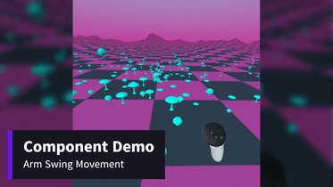

# arm-swing-movement

## Overview

`arm-swing-movement` is an A-Frame component that enables intuitive, full-body locomotion in VR by translating natural arm-swinging gestures into forward (or backward) movement. This component is ideal for VR experiences where you want users to physically feel like they're walking or jogging through the environment - without the need for specialized hardware like an omnidirectional treadmill. It uses the Z-axis reversal of each controller to detect "steps", dynamically calculates a target speed, and moves the player rig accordingly. It supports nav-mesh constrained movement, adjustable smoothing, speed limits, and even synchronized footstep sound playback for added realism.

_Tested with A-Frame 1.7.0_

**[Watch Demo](https://www.youtube.com/watch?v=8FACeUliPiE)**

[](https://www.youtube.com/watch?v=8FACeUliPiE)

**Have a headset? [Try it out in VR!](https://makingspidersense.github.io/mss-aframe-kit/arm-swing-movement/example.html)**

## Features

- **Automatic Speed Calculation**: Translates step cadence into m/s using a linear regression model based on average adult walking speeds.
- **Direction Averaging**: Calculates direction of movement based on both controllers' forward vectors averaged over time.
- **Reverse Movement**: Hold a configured controller button to walk backward.
- **Nav-Mesh Support**: If `movement-controls` is active with `constrainToNavMesh`, movement is clamped to navigable areas.
- **Footstep Sound Feedback**: Optionally play footsteps that adapt in speed with walking pace.

## Basic Usage

Attach the component to your camera rig or player entity. The rig must include left and right tracked controllers and optionally a nav-mesh setup using the popular [movement-controls](https://github.com/c-frame/aframe-extras/blob/master/src/controls/README.md) component:

```html
<!-- Rig -->
<a-entity class="user" position="0 0 6"
    movement-controls="speed: .5; constrainToNavMesh: true;"
    arm-swing-movement="reverseButtonEvent: xbuttondown; soundEntity: #footsteps; soundVolume: .25; oneStepPlaybackRate: .75;">
    <!-- Camera -->
    <a-entity camera position="0 1.6 0"></a-entity>
    <!-- Controllers -->
    <a-entity class="controllers">
        <a-entity id="left-hand" meta-touch-controls="hand: left"></a-entity>
        <a-entity id="right-hand" meta-touch-controls="hand: right"></a-entity>
    </a-entity>
</a-entity>
```

## Properties

| Parameter                    | Type     | Description                                                                                           | Default          | Options                |
| ---------------------------- | -------- | ----------------------------------------------------------------------------------------------------- | ---------------- | ---------------------- |
| `enabled`                    | Boolean  | Enable or disable the component                                                                       | `true`           | `true`, `false`        |
| `leftController`             | Selector | Selector for left controller                                                                          | See code default | CSS selector           |
| `rightController`            | Selector | Selector for right controller                                                                         | See code default | CSS selector           |
| `speedFactor`                | Number   | Multiplier for movement speed                                                                         | `1`              | Any number             |
| `smoothingTime`              | Number   | Time (ms) to smooth speed changes (e.g., at 500 ms, a sudden stop from 6 m/s takes 500 ms to reach 0) | `500`            | ≥ 0                    |
| `minSpeed`                   | Number   | Minimum speed (m/s) to consider the user moving. If null, 0.6 × `speedFactor` is used.                | `null`           | ≥ 0 or `null`          |
| `maxSpeed`                   | Number   | Maximum speed (m/s) the user can move. If null, 10 × `speedFactor` is used.                           | `null`           | ≥ 0 or `null`          |
| `swingTimeout`               | Number   | Time in ms to wait before stopping movement when no new swings are detected                           | `700`            | ≥ 0                    |
| `avgDirectionSampleInterval` | Number   | Milliseconds between directional samples                                                              | `100`            | ≥ 0                    |
| `avgDirectionBufferSize`     | Number   | Number of directional samples to store in buffer                                                      | `20`             | ≥ 1                    |
| `reverseButtonEvent`         | String   | Event name to hold for reverse movement (any of the events that end in `down` or `start` are valid)   | `''`             | Any input event string |
| `reverseButtonHand`          | String   | Hand to use for reverse button event (`left`, `right`, or `''` for both)                              | `''`             | `left`, `right`, `''`  |
| `debug`                      | Boolean  | Show debug arrows and console logs if true                                                            | `false`          | `true`, `false`        |
| `soundEntity`                | Selector | Entity with sound component (typically the sound of footsteps)                                        | `''`             | CSS selector           |
| `soundVolume`                | Number   | Volume of the sound (0 to 1)                                                                          | `1`              | 0 – 1                  |
| `oneStepPlaybackRate`        | Number   | Base playback rate when moving at one step per second. Adjusts dynamically based on speed of steps.   | `1`              | ≥ 0                    |

## Limitations

- The speed model is calibrated for an average adult height and stride. Results may vary for users with different physical attributes.

---

Feel free to reach out to me at [Making Spider Sense](https://makingspidersense.com/contact/) for any questions!
