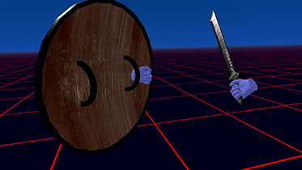

# holdable

## Overview

The `holdable` component allows entities in A-Frame VR scenes to be picked up, held, and released using hand controllers with raycasters. It supports dynamic positioning and rotation offsets, automatic physics handling during grab and release, and custom collision shape preservation.

This component is ideal for VR scenes where users interact with objects, such as picking up tools, throwing props, or manipulating items in a puzzle or simulation.

_Tested with A-Frame 1.7.0_



**Have a headset? [Try it out in VR!](https://makingspidersense.github.io/mss-aframe-kit/holdable/example.html)**

## Basic Usage

Add the `holdable` component to an entity you'd like to make grabbable, such as a model or primitive geometry. Optionally provide local position and rotation offsets:

```html
<a-scene post-model-load-refresh>
    <!-- Holdable Entity: Basketball -->
    <a-entity gltf-model="#basketball" holdable></a-entity>

    <!-- Holdable Entity: Sword -->
    <a-entity gltf-model="#sword" holdable="position: 0 0.1 -0.1; rotation: 0 180 0"></a-entity>

    <!-- Controllers -->
    <a-entity id="rightHand" oculus-touch-controls="hand: right" raycaster="objects: .interactable"></a-entity>
    <a-entity id="leftHand" oculus-touch-controls="hand: left" raycaster="objects: .interactable"></a-entity>
</a-scene>
```

## Properties

| Parameter              | Type    | Description                                                                                         | Default | Options                              |
| ---------------------- | ------- | --------------------------------------------------------------------------------------------------- | ------- | ------------------------------------ |
| position               | vec3    | Local offset position where the object should be held (relative to controller).                     | `0 0 0` | Any position coordinates (in meters) |
| rotation               | vec3    | Local offset rotation applied when held (relative to controller).                                   | `0 0 0` | Any rotation angles (in degrees)     |
| leftHandRotationInvert | array   | If using custom position or rotation, choose the axes to invert for left hand.                      | `y, z`  | `x`, `y`, `z` (comma-separated)      |
| insideMeshDetection    | boolean | Enables detection of controller inside mesh by making materials double-sided (impacts performance). | `true`  | `true`, `false`                      |
| debug                  | boolean | Outputs the relative position and rotation of held objects. Useful for setting custom offsets.      | `false` | `true`, `false`                      |

**Notes**:

- Left-hand interactions mirror the right hand - position and rotation offsets are automatically flipped when grabbing with the left hand. But you can customize the inverted axes with `leftHandRotationInvert`.
- Using "0 0 0" for position or rotation will indicate no custom position or rotation. For rotation, this means the rotation will be the same as the object's original rotation when grabbed.
- For easiest setup, enable `debug: true` and grab the object naturally. Then copy values from console (via [dev tools](https://developer.chrome.com/docs/devtools/remote-debugging) or [vr-logger](../../src/components/vr-logger/vr-logger.js) component).

## Behavior & Features

- **Raycaster Detection:** Object becomes interactable via raycaster when intersected.
- **Controller Grip:** On grip down, object attaches to the controller.
- **Physics Preservation:** Saves and restores original physics settings, including dynamic-body, ammo-body, and shape-based Cannon.js configurations.
- **Throw Velocity:** Upon release, a velocity is applied based on the controller's movement.
- **Rotation Center:** Rotates around the controller (pivot), not the object's center.
- **Grab Offsets:** Supports:
    - Per-object local grab offsets via `position` and `rotation`
    - Global default via `data-holdable-grab-position` set on `<a-scene>` (see below)
    - Fallback to automatically computed grab position/rotation if not specified (model does not move when grabbed)

## Additional Notes

- You don't need to manually add the intersection class (`.interactable`) - `holdable` adds it automatically.
- It's recommended to use the `post-model-load-refresh` component (part of `mss-aframe-kit`) if working with GLTF models to ensure raycasters and physics bodies are refreshed post-load.

## Advanced Usage

- **Grip/Release Property Modifiers:** Use the `holdable-grip-` and `holdable-release-` prefixes to apply component modifications on grip and release, respectively. This allows you to change properties like color, scale, or even apply animations when the object is held or released (e.g. `holdable-grip-material="color: blue; opacity: .1"`).
- **Intersection Class Customization:** Use `data-holdable-intersection-class` on `<a-scene>` to change the default `.interactable` class used for raycaster targeting.
- **Custom Shape Collision Support:** Preserves and restores multiple `shape__*` components with their configs ([Learn More](https://github.com/c-frame/aframe-physics-system/blob/master/CannonDriver.md#shape)).
- **Supports Sleepy Physics Objects:** The `sleepy` component from the `aframe-physics-extras` library can be used to reduce jitter for objects that are stacked ([Learn More](https://github.com/wmurphyrd/aframe-physics-extras?tab=readme-ov-file#sleepy)).
- **Dynamic Body Handling:** If `holdable-dynamic-body` attribute is added to model entity, adds `dynamic-body` on release. This way, it could be a `static-body` or have no physics initially (perfect for something like a hanging picture frame). The `holdable-dynamic-body` can accept additional properties that `dynamic-body` uses, like `mass`, `linearDamping`, etc., to customize the physics behavior when the object is grabbed.

## Limitations

- **No Two-Hand Support:** Only one controller can hold an object at a time.
- **Ammo.js Support is Incomplete:** Collisions do not behave correctly after releasing an object with Ammo.js physics enabled.
- **No Physics While Held**: Held objects are removed from the physics simulation, so they cannot collide with or affect other dynamic objects while being held.
- **No Custom Left Hand Positioning**: Left hand position/rotation cannot be precisely customized at this time. However, you can invert the right hand positioning with `leftHandRotationInvert`, which works for most objects.

---

Feel free to reach out to me at [Making Spider Sense](https://makingspidersense.com/contact/) for any questions!
