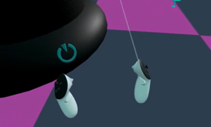

# raycaster-manager

## Overview

`raycaster-manager` is an A-Frame component designed to dynamically enable and disable raycasters attached to VR controllers. It ensures that only one controller's raycaster is active at a time and provides optional audio feedback when toggling. This component assumes a specific scene setup where:
- Controllers have the IDs `left-hand` and `right-hand`.
- Raycasters are children of the controllers with the class `actual-ray`.
- Styled visual rays are siblings to the raycasters with the class `styled-ray`.
- Raycasters are initially disabled by default.

**View Demo**

[](https://www.youtube.com/watch?v=5M6M5AuEHZk)

## Example Usage

Add the `raycaster-manager` component to the scene to enable automatic raycaster management:

```html
<a-scene raycaster-manager>
    <a-entity id="left-hand" meta-touch-controls="hand: left">
        <a-cylinder class="styled-ray ar-left" visible="false" position="0 -.389 -.673" height="1.455" radius="0.002" color="#ffffff" rotation="60 0 0" opacity=".4" sound="src: #raycaster-beep; volume: .1;"></a-cylinder>
        <a-entity class="actual-ray" rotation="-30 0 0"  raycaster="objects: .interactable; autoRefresh: false; enabled: false; far: 1.5; showLine: false; lineColor: red"></a-entity>
    </a-entity>
    <a-entity id="right-hand" meta-touch-controls="hand: right">
        <a-cylinder class="styled-ray ar-right" visible="false" position="0 -.389 -.673" height="1.455" radius="0.002" color="#ffffff" rotation="60 0 0" opacity=".4" sound="src: #raycaster-beep; volume: .1;"></a-cylinder>
        <a-entity class="actual-ray" rotation="-30 0 0"  raycaster="objects: .interactable; autoRefresh: false; enabled: false; far: 1.5; showLine: false; lineColor: red"></a-entity>
    </a-entity>
</a-scene>
```

## How It Works

1. **Trigger Detection**: Listens for the `triggerdown` event on both controllers (`left-hand` and `right-hand`).
2. **Toggle Logic**:
   - If the raycaster is **already active** and not intersecting with an interactable object, it gets disabled.
   - If the raycaster is **inactive**, it gets enabled, and the other controller's raycaster is disabled.
3. **Visual and Audio Feedback**:
   - When enabled, the corresponding `styled-ray` is made visible.
   - If the `styled-ray` has a sound component, it plays an activation sound.

## Limitations

- It is not possible to have both raycasters active simultaneously.
- The component assumes a specifically named controllers and class-based raycaster organization.
- Initially, raycasters must be disabled; the component does not auto-detect their state at initialization.
